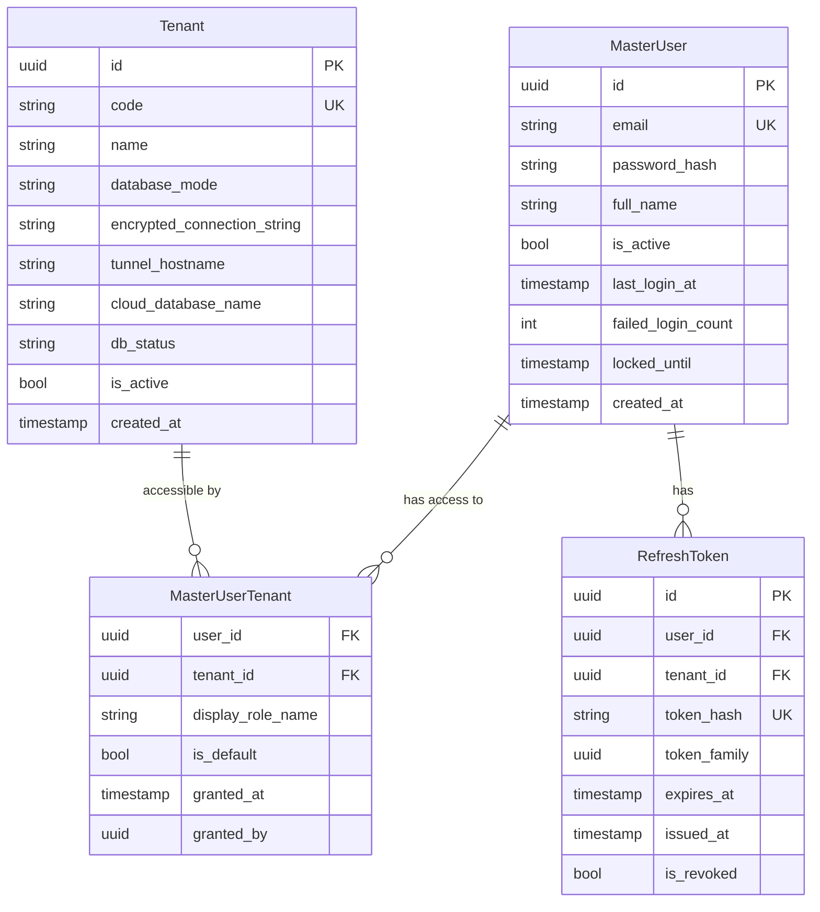
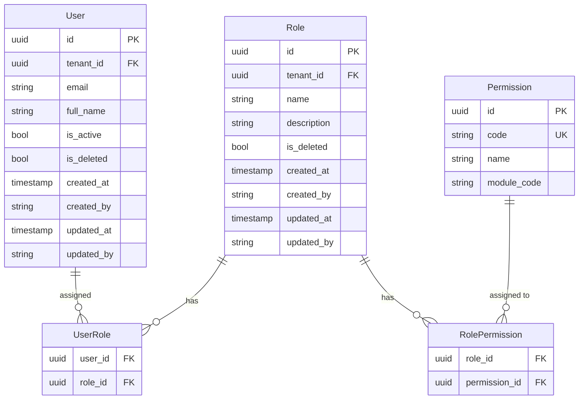

# Data Model: Auth & Tenant Core (Dual-DB Architecture)

> **Architecture**: Phương án B Kết hợp — Master DB (cloud) + Tenant DB (dedicated per-company)
> **Version**: 2.0.0 | **Updated**: 2026-04-16 | **Previous**: v1.0 single-DB (see git history)

---

## Database Architecture Overview

```
┌─────────────────────────────────────────────────────────────────────┐
│                        MASTER DB (always cloud)                     │
│  PostgreSQL — fixed connection string "MasterConnection"            │
│                                                                     │
│  sys_master_users          Central user auth (password, lockout)    │
│  sys_master_user_tenants   User ↔ Company access mapping           │
│  sys_tenants               Company registry (connection info)       │
│  sys_refresh_tokens        JWT refresh tokens (with tenant_id)     │
│                                                                     │
│  EF Core: MasterDbContext — NO tenant query filters                │
└─────────────────────────────────────────────────────────────────────┘

┌─────────────────────────────────────────────────────────────────────┐
│                TENANT DB (per-company, cloud OR on-premise)         │
│  PostgreSQL — connection resolved per-request via                   │
│               ITenantConnectionResolver + TenantDbContextFactory    │
│                                                                     │
│  sys_users                 Tenant-level profile (NO password)       │
│  sys_roles                 Roles scoped to this company             │
│  sys_permissions           Global permission codes (read-only)      │
│  sys_user_roles            User ↔ Role assignment                  │
│  sys_role_permissions      Role ↔ Permission assignment            │
│  + ALL accounting tables   (future modules: GL, CA, BA, etc.)      │
│                                                                     │
│  EF Core: ApplicationDbContext — tenant query filters on User,Role │
└─────────────────────────────────────────────────────────────────────┘

Cross-DB Convention: MasterUser.Id = User.Id (same GUID, no FK constraint)
```

---

## Entity Relationship Diagrams

### Master DB ER Diagram



### Tenant DB ER Diagram



> **Cross-DB Link**: `User.Id` in Tenant DB = `MasterUser.Id` in Master DB (same GUID by convention). No cross-database FK constraint — enforced by `CreateUserCommandHandler`.

---

## PostgreSQL Tables — Master DB

### sys_master_users

| Column | Type | Constraints |
|--------|------|-------------|
| id | uuid | PK, default gen_random_uuid() |
| email | varchar(256) | NOT NULL, UNIQUE |
| password_hash | varchar(100) | NOT NULL |
| full_name | varchar(200) | NOT NULL |
| is_active | boolean | NOT NULL, default true |
| last_login_at | timestamptz | NULL |
| failed_login_count | int | NOT NULL, default 0 |
| locked_until | timestamptz | NULL |
| created_at | timestamptz | NOT NULL |

**Unique constraint**: `uq_sys_master_users_email` on `email`
**Indexes**:
- `idx_sys_master_users_email` UNIQUE on `email` (login lookup — O(1))

> **Note**: Password, lockout (FailedLoginCount, LockedUntil), and LastLoginAt are stored here — NOT in Tenant DB. One password for all companies.

---

### sys_master_user_tenants

| Column | Type | Constraints |
|--------|------|-------------|
| user_id | uuid | FK → sys_master_users.id, NOT NULL |
| tenant_id | uuid | FK → sys_tenants.id, NOT NULL |
| display_role_name | varchar(100) | NULL (shown in company-select UI, e.g. "Kế toán trưởng") |
| is_default | boolean | NOT NULL, default false |
| granted_at | timestamptz | NOT NULL |
| granted_by | uuid | NULL (FK → sys_master_users.id, who granted access) |

**Primary key**: `(user_id, tenant_id)`
**Indexes**:
- `idx_sys_mut_tenant_id` on `tenant_id` (find all users of a company)
- `idx_sys_mut_user_id` on `user_id` (find all companies of a user — login step 1)

**Cascade delete**: CASCADE on `user_id` (removing MasterUser removes all access). RESTRICT on `tenant_id` (cannot delete tenant with mapped users).

---

### sys_tenants

| Column | Type | Constraints |
|--------|------|-------------|
| id | uuid | PK, default gen_random_uuid() |
| code | varchar(50) | NOT NULL, UNIQUE |
| name | varchar(200) | NOT NULL |
| database_mode | varchar(20) | NOT NULL, default 'CloudManaged' — enum: `CloudManaged`, `OnPremise` |
| encrypted_connection_string | text | NULL (for OnPremise: encrypted via DataProtection API) |
| tunnel_hostname | varchar(200) | NULL (for OnPremise: e.g. `db-acme.tunnel.app`) |
| cloud_database_name | varchar(100) | NULL (for CloudManaged: e.g. `phanmemketoan_tenant_acme`) |
| db_status | varchar(20) | NOT NULL, default 'Online' — enum: `Online`, `Offline`, `Provisioning`, `Migrating` |
| is_active | boolean | NOT NULL, default true |
| created_at | timestamptz | NOT NULL |

**Unique constraint**: `uq_sys_tenants_code` on `code`
**Indexes**:
- `idx_sys_tenants_code` UNIQUE on `code` (tenant lookup by code)
- `idx_sys_tenants_db_status` on `db_status` (filter online tenants)

> **Connection Resolution**: `ITenantConnectionResolver` reads `database_mode`:
> - `CloudManaged` → builds connection from `CloudDatabaseHost` (appsettings) + `cloud_database_name`
> - `OnPremise` → decrypts `encrypted_connection_string` via `IConnectionStringEncryptor`, connects via `tunnel_hostname`

---

### sys_refresh_tokens

| Column | Type | Constraints |
|--------|------|-------------|
| id | uuid | PK, default gen_random_uuid() |
| user_id | uuid | FK → sys_master_users.id, NOT NULL |
| tenant_id | uuid | FK → sys_tenants.id, NOT NULL |
| token_hash | varchar(64) | NOT NULL, UNIQUE (SHA-256 hex = 64 chars) |
| token_family | uuid | NOT NULL |
| expires_at | timestamptz | NOT NULL |
| issued_at | timestamptz | NOT NULL |
| is_revoked | boolean | NOT NULL, default false |

**Unique constraint**: `uq_sys_refresh_tokens_hash` on `token_hash`
**Indexes**:
- `idx_sys_refresh_tokens_user_id` on `user_id`
- `idx_sys_refresh_tokens_tenant_id` on `tenant_id` (find tokens for a specific company)
- `idx_sys_refresh_tokens_token_hash` on `token_hash` (fast lookup on refresh)
- `idx_sys_refresh_tokens_family_active` on `(token_family, is_revoked)` WHERE `is_revoked = false` (family revocation scan)

**Cascade delete**: CASCADE on `user_id` (deleting a MasterUser removes all their refresh tokens)

> **Note**: `tenant_id` is required to resolve which Tenant DB to connect to during token refresh. FK references `sys_tenants.id`, NOT `sys_users`.

---

## PostgreSQL Tables — Tenant DB

### sys_users

| Column | Type | Constraints |
|--------|------|-------------|
| id | uuid | PK, default gen_random_uuid() |
| tenant_id | uuid | NOT NULL (no FK — Tenant table is in Master DB) |
| email | varchar(256) | NOT NULL |
| full_name | varchar(200) | NOT NULL |
| is_active | boolean | NOT NULL, default true |
| created_at | timestamptz | NOT NULL |
| created_by | varchar(200) | NULL |
| updated_at | timestamptz | NULL |
| updated_by | varchar(200) | NULL |
| is_deleted | boolean | NOT NULL, default false |

> **REMOVED from v1**: `password_hash`, `last_login_at`, `failed_login_count`, `locked_until` — all moved to `sys_master_users` in Master DB. Password is stored centrally for cross-company auth.

**Unique constraint**: `uq_sys_users_tenant_email` on `(tenant_id, email)`
**Indexes**:
- `idx_sys_users_tenant_id` on `tenant_id`
- `idx_sys_users_tenant_email` on `(tenant_id, email)` (covers filtered queries)
- `idx_sys_users_is_active` partial on `is_active` WHERE `is_active = true`

---

### sys_roles

| Column | Type | Constraints |
|--------|------|-------------|
| id | uuid | PK, default gen_random_uuid() |
| tenant_id | uuid | NOT NULL |
| name | varchar(100) | NOT NULL |
| description | varchar(500) | NULL |
| created_at | timestamptz | NOT NULL |
| created_by | varchar(200) | NULL |
| updated_at | timestamptz | NULL |
| updated_by | varchar(200) | NULL |
| is_deleted | boolean | NOT NULL, default false |

**Unique constraint**: `uq_sys_roles_tenant_name` on `(tenant_id, name)`
**Indexes**:
- `idx_sys_roles_tenant_id` on `tenant_id`

---

### sys_permissions

| Column | Type | Constraints |
|--------|------|-------------|
| id | uuid | PK, default gen_random_uuid() |
| code | varchar(100) | NOT NULL, UNIQUE |
| name | varchar(200) | NOT NULL |
| module_code | varchar(10) | NOT NULL |

**Unique constraint**: `uq_sys_permissions_code` on `code`
**Indexes**:
- `idx_sys_permissions_module_code` on `module_code`

**Sample permission codes** (pattern: `<MODULE>.<Resource>.<Action>`):

| Module | Sample Permissions |
|--------|--------------------|
| SYS | SYS.Users.View, SYS.Users.Manage, SYS.Roles.View, SYS.Roles.Manage |
| GL | GL.Journal.View, GL.Journal.Create, GL.Journal.Edit, GL.Journal.Delete, GL.Journal.Post |
| CA | CA.Receipt.View, CA.Receipt.Create, CA.Receipt.Edit, CA.Receipt.Post |
| BA | BA.BankTransaction.View, BA.BankTransaction.Create, BA.BankTransaction.Post |
| PU | PU.PurchaseOrder.View, PU.PurchaseOrder.Create, PU.Invoice.View, PU.Invoice.Post |
| SA | SA.SalesOrder.View, SA.SalesOrder.Create, SA.Invoice.View, SA.Invoice.Post |
| IN | IN.InventoryTransaction.View, IN.InventoryTransaction.Create, IN.InventoryTransaction.Post |
| FA | FA.Asset.View, FA.Asset.Create, FA.Depreciation.Post |
| ... | *(All 15 modules seeded via migration)* |

> **Note**: Permissions are global/shared. The same set of permission codes is seeded in every Tenant DB via migration. Permissions are read-only at runtime — no UI/API to create them.

---

### sys_user_roles

| Column | Type | Constraints |
|--------|------|-------------|
| user_id | uuid | FK → sys_users.id, NOT NULL |
| role_id | uuid | FK → sys_roles.id, NOT NULL |

**Primary key**: `(user_id, role_id)`
**Cascade delete**: CASCADE on both user_id and role_id

---

### sys_role_permissions

| Column | Type | Constraints |
|--------|------|-------------|
| role_id | uuid | FK → sys_roles.id, NOT NULL |
| permission_id | uuid | FK → sys_permissions.id, NOT NULL |

**Primary key**: `(role_id, permission_id)`
**Cascade delete**: CASCADE on both role_id and permission_id

---

## Index Strategy Summary

### Master DB Indexes

| Table | Index | Type | Purpose |
|-------|-------|------|---------|
| sys_master_users | `idx_sys_master_users_email` | UNIQUE BTREE | Login lookup by email |
| sys_master_user_tenants | `idx_sys_mut_tenant_id` | BTREE | Find users of a company |
| sys_master_user_tenants | `idx_sys_mut_user_id` | BTREE | Find companies of a user (login step 1) |
| sys_tenants | `idx_sys_tenants_code` | UNIQUE BTREE | Tenant lookup by code |
| sys_tenants | `idx_sys_tenants_db_status` | BTREE | Filter online tenants |
| sys_refresh_tokens | `idx_sys_refresh_tokens_user_id` | BTREE | User's tokens lookup |
| sys_refresh_tokens | `idx_sys_refresh_tokens_tenant_id` | BTREE | Tokens per company |
| sys_refresh_tokens | `idx_sys_refresh_tokens_token_hash` | UNIQUE BTREE | O(1) token lookup on refresh |
| sys_refresh_tokens | `idx_sys_refresh_tokens_family_active` | PARTIAL BTREE | Family revocation scan |

### Tenant DB Indexes

| Table | Index | Type | Purpose |
|-------|-------|------|---------|
| sys_users | `idx_sys_users_tenant_id` | BTREE | EF global filter tenant scan |
| sys_users | `idx_sys_users_tenant_email` | BTREE | Email uniqueness + lookup |
| sys_roles | `idx_sys_roles_tenant_id` | BTREE | EF global filter tenant scan |
| sys_permissions | `idx_sys_permissions_module_code` | BTREE | Group-by-module queries |

---

## EF Core Configuration Notes

### Dual DbContext Architecture

The application uses **two separate EF Core DbContexts** targeting different databases:

| DbContext | Database | Connection | Tenant Filters |
|-----------|----------|------------|----------------|
| `MasterDbContext` | Master DB | Fixed from `"MasterConnection"` in appsettings | **NONE** — all data is cross-tenant |
| `ApplicationDbContext` | Tenant DB | Per-request via `TenantDbContextFactory` + `ITenantConnectionResolver` | `User`, `Role` filtered by `TenantId` |

```csharp
// MasterDbContext — central auth data, NO filters
public class MasterDbContext : DbContext, IMasterDbContext
{
    public DbSet<Tenant> Tenants => Set<Tenant>();
    public DbSet<MasterUser> MasterUsers => Set<MasterUser>();
    public DbSet<MasterUserTenant> MasterUserTenants => Set<MasterUserTenant>();
    public DbSet<RefreshToken> RefreshTokens => Set<RefreshToken>();
}

// ApplicationDbContext — per-tenant accounting data, WITH filters
public class ApplicationDbContext : DbContext, IApplicationDbContext
{
    public DbSet<User> Users => Set<User>();
    public DbSet<Role> Roles => Set<Role>();
    public DbSet<Permission> Permissions => Set<Permission>();
    public DbSet<UserRole> UserRoles => Set<UserRole>();
    public DbSet<RolePermission> RolePermissions => Set<RolePermission>();
    // + future accounting DbSets (Voucher, VoucherDetail, GeneralLedger, etc.)
}
```

### Naming
- `UseSnakeCaseNamingConvention()` (EFCore.NamingConventions) applied globally in `OnModelCreating` for BOTH contexts.
- All table names are explicitly overridden via `ToTable("sys_<tablename>")` to stay in the `sys_` namespace.

### Global Query Filters (ApplicationDbContext only)
Entities that receive the global filter: `User`, `Role`. The filter is applied as:
```csharp
// In ApplicationDbContext.OnModelCreating()
modelBuilder.Entity<User>().HasQueryFilter(u => u.TenantId == _tenantContext.TenantId);
modelBuilder.Entity<Role>().HasQueryFilter(r => r.TenantId == _tenantContext.TenantId);
```
Entities NOT filtered: `Permission`, `UserRole`, `RolePermission`.
`UserRole` and `RolePermission` are accessed only through their parent navigation properties (User.UserRoles, Role.RolePermissions), which are already scoped by the parent entity's filter.

> **MasterDbContext has NO query filters** — it manages cross-tenant data (all users, all tenants, all tokens).

### Cross-DB Identity Convention
`MasterUser.Id` = `User.Id` — the same GUID is used in both databases. This is enforced by application code in `CreateUserCommandHandler`:
1. Create `User` in Tenant DB with a specific `Id`
2. Create or link `MasterUser` in Master DB with the **same `Id`**
3. No cross-database FK constraint — consistency enforced at Application layer

### Cascade Delete Rules

**Master DB:**

| Relationship | On Delete |
|-------------|-----------|
| MasterUser → MasterUserTenant | Cascade |
| MasterUser → RefreshToken | Cascade |
| Tenant → MasterUserTenant | Restrict |

**Tenant DB:**

| Relationship | On Delete |
|-------------|-----------|
| User → UserRole | Cascade |
| Role → UserRole | Cascade |
| Role → RolePermission | Cascade |
| Permission → RolePermission | Cascade |

### Cross-DB Consistency (Application Layer Enforcement)

| Rule | Enforced By |
|------|-------------|
| `UserRole.UserId.TenantId == UserRole.RoleId.TenantId` | `CreateUserCommandHandler`, `AssignRoleToUserCommandHandler` |
| `User.Id == MasterUser.Id` (same GUID) | `CreateUserCommandHandler` |
| CreateUser → also creates/links MasterUser | `CreateUserCommandHandler` (dual-context save) |
| ChangePassword → updates MasterUser, NOT User | `ChangePasswordCommandHandler` |
| ToggleActivation → revokes RefreshTokens in Master DB | `ToggleUserActivationCommandHandler` |

### Value Objects
- No value objects defined at this layer — all fields are primitive types. Future refactor may introduce `Email` value object with validation.

### Soft Delete
- `User.IsActive` — users are never hard-deleted. `IsActive = false` is the soft-delete mechanism.
- `Role`: soft-deleted via `IsDeleted = true` (Constitution requirement — all AuditableEntity-inheriting entities use soft-delete). `DeleteRoleCommand` sets `IsDeleted = true` only after verifying no active user assignments exist. `RolePermission` join rows ARE hard-deleted alongside the soft-delete (no audit value in orphaned join rows).
- `MasterUser.IsActive` — central deactivation. If `IsActive = false`, login is blocked across ALL companies.
- `RefreshToken`: cleaned up via a background job (`IHostedService`) that deletes expired tokens older than 24 hours beyond their `ExpiresAt`. Runs against **Master DB**.

### Migration Folders
- `Infrastructure/Persistence/Migrations/Master/` — migrations for `MasterDbContext`
- `Infrastructure/Persistence/Migrations/Tenant/` — migrations for `ApplicationDbContext`

Commands:
```bash
# Master DB
dotnet ef migrations add <Name> --context MasterDbContext --output-dir Persistence/Migrations/Master
dotnet ef database update --context MasterDbContext

# Tenant DB
dotnet ef migrations add <Name> --context ApplicationDbContext --output-dir Persistence/Migrations/Tenant
dotnet ef database update --context ApplicationDbContext
```
