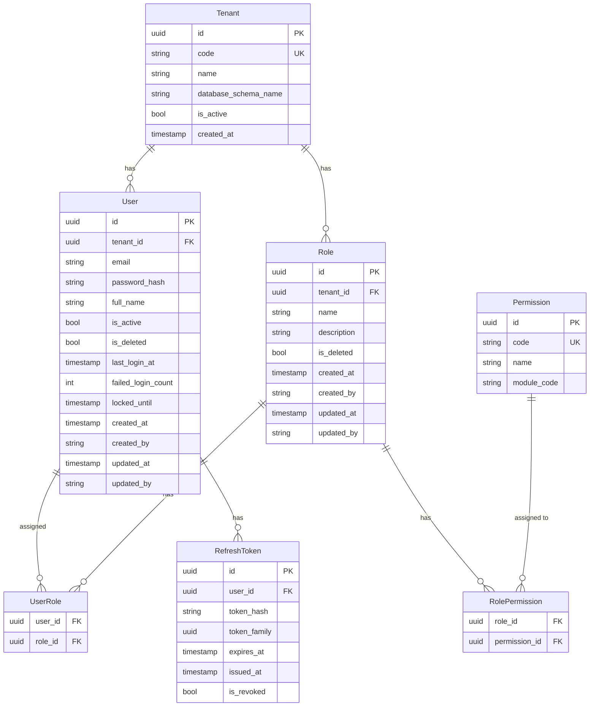

# Data Model: Auth & Tenant Core

## Entity Relationship Diagram



---

## PostgreSQL Tables

### sys_tenants

| Column | Type | Constraints |
|--------|------|-------------|
| id | uuid | PK, default gen_random_uuid() |
| code | varchar(50) | NOT NULL, UNIQUE |
| name | varchar(200) | NOT NULL |
| database_schema_name | varchar(100) | NULL |
| is_active | boolean | NOT NULL, default true |
| created_at | timestamptz | NOT NULL |

**Indexes**: `idx_sys_tenants_code` UNIQUE on `code`

---

### sys_users

| Column | Type | Constraints |
|--------|------|-------------|
| id | uuid | PK, default gen_random_uuid() |
| tenant_id | uuid | FK → sys_tenants.id, NOT NULL |
| email | varchar(256) | NOT NULL |
| password_hash | varchar(100) | NOT NULL |
| full_name | varchar(200) | NOT NULL |
| is_active | boolean | NOT NULL, default true |
| last_login_at | timestamptz | NULL |
| failed_login_count | int | NOT NULL, default 0 |
| locked_until | timestamptz | NULL |
| created_at | timestamptz | NOT NULL |
| created_by | varchar(200) | NULL |
| updated_at | timestamptz | NULL |
| updated_by | varchar(200) | NULL |
| is_deleted | boolean | NOT NULL, default false |

**Unique constraint**: `uq_sys_users_tenant_email` on `(tenant_id, email)`  
**Indexes**:
- `idx_sys_users_tenant_id` on `tenant_id`
- `idx_sys_users_tenant_email` on `(tenant_id, email)` (covers filtered queries)
- `idx_sys_users_is_active` partial on `is_active` WHERE `is_active = true`

---

### sys_roles

| Column | Type | Constraints |
|--------|------|-------------|
| id | uuid | PK, default gen_random_uuid() |
| tenant_id | uuid | FK → sys_tenants.id, NOT NULL |
| name | varchar(100) | NOT NULL |
| description | varchar(500) | NULL |
| created_at | timestamptz | NOT NULL |
| created_by | varchar(200) | NULL |
| updated_at | timestamptz | NULL |
| updated_by | varchar(200) | NULL |
| is_deleted | boolean | NOT NULL, default false |

**Unique constraint**: `uq_sys_roles_tenant_name` on `(tenant_id, name)`  
**Indexes**:
- `idx_sys_roles_tenant_id` on `tenant_id`

---

### sys_permissions

| Column | Type | Constraints |
|--------|------|-------------|
| id | uuid | PK, default gen_random_uuid() |
| code | varchar(100) | NOT NULL, UNIQUE |
| name | varchar(200) | NOT NULL |
| module_code | varchar(10) | NOT NULL |

**Unique constraint**: `uq_sys_permissions_code` on `code`  
**Indexes**:
- `idx_sys_permissions_module_code` on `module_code`

**Sample permission codes** (pattern: `<MODULE>.<Resource>.<Action>`):

| Module | Sample Permissions |
|--------|--------------------|
| SYS | SYS.Users.View, SYS.Users.Manage, SYS.Roles.View, SYS.Roles.Manage |
| GL | GL.Journal.View, GL.Journal.Create, GL.Journal.Edit, GL.Journal.Delete, GL.Journal.Post |
| CA | CA.Receipt.View, CA.Receipt.Create, CA.Receipt.Edit, CA.Receipt.Post |
| BA | BA.BankTransaction.View, BA.BankTransaction.Create, BA.BankTransaction.Post |
| PU | PU.PurchaseOrder.View, PU.PurchaseOrder.Create, PU.Invoice.View, PU.Invoice.Post |
| SA | SA.SalesOrder.View, SA.SalesOrder.Create, SA.Invoice.View, SA.Invoice.Post |
| IN | IN.InventoryTransaction.View, IN.InventoryTransaction.Create, IN.InventoryTransaction.Post |
| FA | FA.Asset.View, FA.Asset.Create, FA.Depreciation.Post |
| ... | *(All 15 modules seeded via migration)* |

---

### sys_user_roles

| Column | Type | Constraints |
|--------|------|-------------|
| user_id | uuid | FK → sys_users.id, NOT NULL |
| role_id | uuid | FK → sys_roles.id, NOT NULL |

**Primary key**: `(user_id, role_id)`  
**Cascade delete**: CASCADE on both user_id and role_id

---

### sys_role_permissions

| Column | Type | Constraints |
|--------|------|-------------|
| role_id | uuid | FK → sys_roles.id, NOT NULL |
| permission_id | uuid | FK → sys_permissions.id, NOT NULL |

**Primary key**: `(role_id, permission_id)`  
**Cascade delete**: CASCADE on both role_id and permission_id

---

### sys_refresh_tokens

| Column | Type | Constraints |
|--------|------|-------------|
| id | uuid | PK, default gen_random_uuid() |
| user_id | uuid | FK → sys_users.id, NOT NULL |
| token_hash | varchar(64) | NOT NULL, UNIQUE (SHA-256 hex = 64 chars) |
| token_family | uuid | NOT NULL |
| expires_at | timestamptz | NOT NULL |
| issued_at | timestamptz | NOT NULL |
| is_revoked | boolean | NOT NULL, default false |

**Unique constraint**: `uq_sys_refresh_tokens_hash` on `token_hash`  
**Indexes**:
- `idx_sys_refresh_tokens_user_id` on `user_id`
- `idx_sys_refresh_tokens_token_hash` on `token_hash` (fast lookup on refresh)
- `idx_sys_refresh_tokens_family_active` on `(token_family, is_revoked)` WHERE `is_revoked = false` (family revocation scan)

**Cascade delete**: CASCADE on `user_id` (deleting a user removes all their refresh tokens)

---

## Index Strategy Summary

| Table | Index | Type | Purpose |
|-------|-------|------|---------|
| sys_tenants | `idx_sys_tenants_code` | UNIQUE BTREE | Tenant lookup by code |
| sys_users | `idx_sys_users_tenant_id` | BTREE | EF global filter tenant scan |
| sys_users | `idx_sys_users_tenant_email` | BTREE | Login lookup + uniqueness check |
| sys_roles | `idx_sys_roles_tenant_id` | BTREE | EF global filter tenant scan |
| sys_permissions | `idx_sys_permissions_module_code` | BTREE | Group-by-module queries |
| sys_refresh_tokens | `idx_sys_refresh_tokens_token_hash` | UNIQUE BTREE | O(1) token lookup on refresh |
| sys_refresh_tokens | `idx_sys_refresh_tokens_family_active` | PARTIAL BTREE | Family revocation scan |

---

## EF Core Configuration Notes

### Naming
- `UseSnakeCaseNamingConvention()` (EFCore.NamingConventions) applied globally in `OnModelCreating`.
- All table names are explicitly overridden via `ToTable("sys_<tablename>")` to stay in the `sys_` namespace.

### Global Query Filters (ITenantEntity)
Entities that receive the global filter: `User`, `Role`. The filter is applied as:
```csharp
modelBuilder.Entity<User>().HasQueryFilter(u => u.TenantId == _tenantContext.TenantId);
modelBuilder.Entity<Role>().HasQueryFilter(r => r.TenantId == _tenantContext.TenantId);
```
Entities NOT filtered: `Tenant`, `Permission`, `RefreshToken`, `UserRole`, `RolePermission`.
`UserRole` and `RolePermission` are accessed only through their parent navigation properties (User.UserRoles, Role.RolePermissions), which are already scoped by the parent entity's filter.

### Cascade Delete Rules
| Relationship | On Delete |
|-------------|-----------|
| User → UserRole | Cascade |
| Role → UserRole | Cascade |
| Role → RolePermission | Cascade |
| Permission → RolePermission | Cascade |
| User → RefreshToken | Cascade |

### Cross-Tenant Consistency (Application Layer Enforcement)
`UserRole.UserId.TenantId` must equal `UserRole.RoleId.TenantId`. This cannot be enforced via a single FK constraint in a shared-schema multi-tenant design. The `CreateUserCommandHandler` and `AssignRoleToUserCommandHandler` explicitly verify that the role's TenantId matches the user's TenantId before creating the join record.

### Value Objects
- No value objects defined at this layer — all fields are primitive types. Future refactor may introduce `Email` value object with validation.

### Soft Delete
- `User.IsActive` — users are never hard-deleted. `IsActive = false` is the soft-delete mechanism.
- `Role`: soft-deleted via `IsDeleted = true` (Constitution requirement — all AuditableEntity-inheriting entities use soft-delete). `DeleteRoleCommand` sets `IsDeleted = true` only after verifying no active user assignments exist. `RolePermission` join rows ARE hard-deleted alongside the soft-delete (no audit value in orphaned join rows).
- `RefreshToken`: cleaned up via a background job (`IHostedService`) that deletes expired tokens older than 24 hours beyond their `ExpiresAt`.
